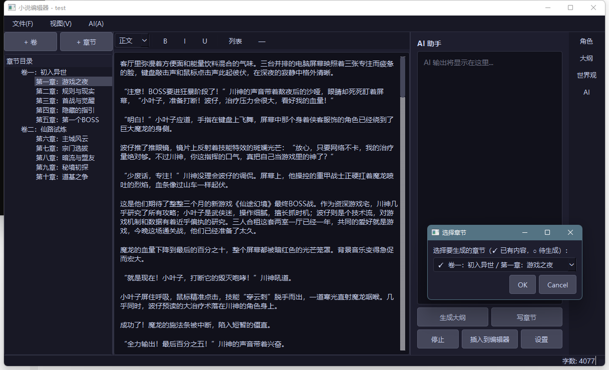

# 小说编辑器

基于 PySide6 的桌面小说写作工具，集成 AI 辅助创作功能。



## 最新版本：v1.3

## v1.3 改动内容

- 修复项目切换生命周期：切换项目时先保存当前章节并关闭旧项目数据库连接，重置当前章节状态，避免跨项目状态污染。
- 修复批量写章节状态机：空输出/异常/章节不存在时不再卡死，批量任务可继续或正确收尾，并显示成功/失败统计。
- 新增大纲拖拽持久化：拖拽调整大纲结构后会写回 `parent_id` 与 `sort_order`，重开项目后顺序保持一致。
## 功能

### 编辑器
- 富文本编辑（加粗、斜体、下划线、多级标题、列表）
- 章节树管理，支持卷/章层级和拖拽排序
- 自动保存（30秒间隔）
- 实时字数统计

### 创作管理
- 角色档案管理（QTabWidget：角色列表 + 关系图）
- 世界观设定（分类管理）
- 多层级大纲（总纲/卷纲/章纲，双击定位章节）
- 角色关系图（环形布局、拖拽节点、关系类型颜色区分）

### AI 辅助
- **生成大纲** — 输入标题、题材、构思，AI 自动生成完整卷章结构并导入项目
- **写章节** — 选择任意章节生成内容，标记已写/待写状态，写完自动保存
- **批量写章节** — 勾选多个章节，队列式逐章生成，进度条显示，可中途停止
- **AI 续写** — 根据当前内容和上下文继续写作
- **AI 润色** — 优化选中文本的文学性和可读性
- **生成摘要** — 为章节生成结构化摘要，供后续写作参考
- **AI 对话模式** — 基于小说上下文的自由对话，流式输出，会话历史保持
- 三层记忆架构：全局锚定（角色/世界观/大纲）+ 滚动摘要 + 近章原文
- 兼容 DeepSeek、OpenAI 等所有 OpenAI 兼容 API

### 项目管理
- `.novel` 项目文件（SQLite 数据库）
- 导出 TXT / DOCX
- 深色主题

### 关于
- 使用说明、项目主页链接、在线检查更新
- 标题栏显示当前版本号

## 快速开始

```bash
# 安装依赖
pip install -r requirements.txt

# 启动
python main.py
```

首次使用：点击右侧 **AI → 设置**，配置 API Key、Base URL 和模型名称。

## 技术栈

- **GUI**: PySide6
- **数据库**: SQLite
- **AI**: OpenAI Python SDK（兼容 DeepSeek 等）
- **Python**: 3.11+

## 配置说明

AI 配置保存在用户目录 `~/.novel_editor/config.json`，不包含在项目代码中。

配置示例：
```json
{
  "ai": {
    "api_key": "your-api-key",
    "base_url": "https://api.deepseek.com/v1",
    "model": "deepseek-chat",
    "max_tokens": 2000,
    "temperature": 0.7
  }
}
```

## 下一步计划

- [x] 批量生成多章
- [x] 大纲面板与章节树联动
- [x] AI 对话模式
- [x] 角色关系图
- [x] 打包为 exe（GitHub Actions + PyInstaller）
- [x] 关于菜单（使用说明、项目主页、检查更新）
- [x] 标题栏版本号显示

## 许可

MIT
